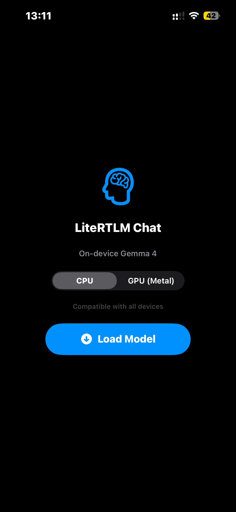
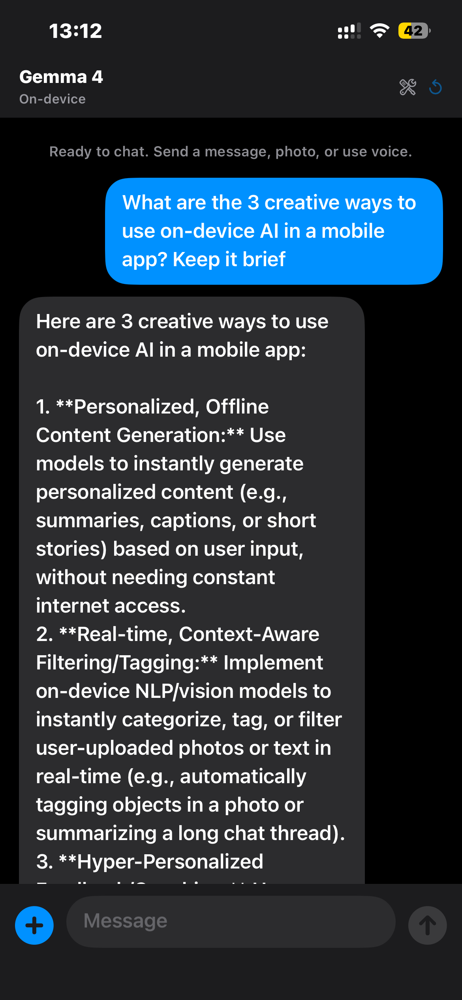
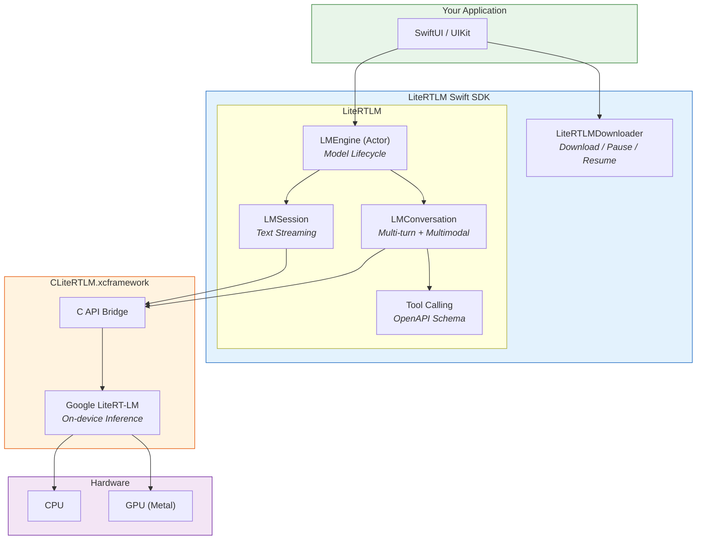

# LiteRTLM Swift SDK

> **Unofficial** Swift SDK for [Google's LiteRT-LM](https://github.com/google-ai-edge/LiteRT-LM) on-device inference engine. Not affiliated with or endorsed by Google.

Run Gemma 4 and other LLMs **entirely on-device** — text, vision, audio, and tool calling with zero cloud dependency.

[](https://swift.org)
[](https://developer.apple.com)
[](LICENSE)

## Screenshots

<table>
  <tr>
    <td align="center"><b>Model Setup</b><br></td>
    <td align="center"><b>Text Chat</b><br></td>
    <td align="center"><b>Vision Input</b><br></td>
    <td align="center"><b>Audio Response</b><br></td>
  </tr>
</table>



---

## Features

| Feature | Description |
|---------|-------------|
| **Text Generation** | Streaming and blocking generation with Gemma 4 prompt templates |
| **Vision** | Send images (JPEG/PNG) alongside text for multimodal understanding |
| **Audio** | Process raw WAV audio input — passed directly to the model |
| **Multi-turn Conversations** | Automatic KV-cache and history management |
| **Tool Calling** | Register functions the model can invoke (automatic or manual execution) |
| **GPU Inference** | Metal accelerator bundled for GPU-accelerated text generation |
| **Model Management** | Download, pause/resume, cancel `.litertlm` model files with progress |
| **Streaming** | `AsyncSequence`-based token streaming with clean text output |
| **Benchmark Metrics** | Prefill/decode speed, time-to-first-token, per-turn breakdowns |
| **Actor Concurrency** | Thread-safe engine access via Swift actors |

---

## Installation

### Swift Package Manager

Add to your `Package.swift`:

```swift
dependencies: [
    .package(
        url: "https://github.com/Luxshan2000/LiteRTLM-Swift-SDK.git",
        from: "0.1.0"
    )
]
```

Add products to your target:

```swift
.target(
    name: "YourApp",
    dependencies: [
        .product(name: "LiteRTLM", package: "LiteRTLM-Swift-SDK"),
        .product(name: "LiteRTLMDownloader", package: "LiteRTLM-Swift-SDK"),
    ]
)
```

Or in Xcode: **File > Add Package Dependencies** > paste the repository URL.

### Required Setup

**Entitlements** (iOS) — models consume ~4 GB RAM:

```xml
<key>com.apple.developer.kernel.increased-memory-limit</key>
<true/>
<key>com.apple.developer.kernel.extended-virtual-addressing</key>
<true/>
```

**Codesign** — the xcframework includes companion dylibs that Xcode may not auto-sign. Add a **Run Script** build phase:

```bash
for DYLIB in \
  "${BUILT_PRODUCTS_DIR}/${FRAMEWORKS_FOLDER_PATH}/CLiteRTLM.framework/libGemmaModelConstraintProvider.dylib" \
  "${BUILT_PRODUCTS_DIR}/${FRAMEWORKS_FOLDER_PATH}/CLiteRTLM.framework/libLiteRtMetalAccelerator.dylib"; do
  if [ -f "$DYLIB" ]; then
    /usr/bin/codesign --force --sign "${EXPANDED_CODE_SIGN_IDENTITY}" "$DYLIB"
  fi
done
```

---

## Quick Start

```swift
import LiteRTLM
import LiteRTLMDownloader

// 1. Download the model (~2.4 GB, cached after first download)
let downloader = ModelDownloader()
await downloader.download(model: .gemma4E2B)

// 2. Create and load the engine
let config = EngineConfiguration(modelPath: downloader.modelPath(for: .gemma4E2B)!)
    .backend(.cpu)           // or .gpu for Metal acceleration
    .visionBackend(.cpu)
    .audioBackend(.cpu)
    .maxTokens(4096)
let engine = LMEngine(configuration: config)
try await engine.load()

// 3. Chat
let conversation = try await engine.createConversation()
let reply = try await conversation.send("Hello! What can you do?")
print(reply)

// 4. Cleanup
conversation.close()
await engine.unload()
```

---

## Usage

### Text Streaming

```swift
let conversation = try await engine.createConversation(
    configuration: ConversationConfiguration()
        .maxOutputTokens(1024)
        .sampler(SamplerConfiguration(temperature: 0.7, topK: 40, topP: 0.95, samplerType: .topP))
)

// Stream tokens as they generate
let stream = try conversation.sendStream("Explain quantum computing simply")
for try await token in stream {
    print(token, terminator: "")
}

// Or blocking
let response = try await conversation.send("What is Swift?")
```

### Vision (Image Input)

```swift
let photoData = UIImage(named: "cat")!.jpegData(compressionQuality: 0.8)!
let description = try await conversation.send(
    "What's in this image?",
    images: [photoData]
)
```

Images are automatically saved to temp files and passed as file paths to the C API. Resized to fit max dimension (default 1024px).

### Audio Input

```swift
let audioData = try Data(contentsOf: recordingURL) // 16kHz mono WAV
let response = try await conversation.send(
    "What did they say?",
    audio: [audioData]
)
```

### Multi-turn Conversation

Conversations maintain KV-cache across turns. First turn takes ~15-30s, follow-ups are much faster.

```swift
let reply1 = try await conversation.send("Tell me about Tokyo")
let reply2 = try await conversation.send("What about the food scene?")
let reply3 = try await conversation.send("Give me a 3-day itinerary")

// History tracked automatically
print(conversation.history.count) // 6 messages
```

### Tool Calling

```swift
let weatherTool = Tool(
    name: "get_weather",
    description: "Get current weather for a location",
    parameters: [
        .init(name: "city", type: .string, description: "City name", required: true),
    ]
) { args in
    let city = args["city"] as? String ?? "unknown"
    return ["temperature": 22, "condition": "sunny", "city": city]
}

let conversation = try await engine.createConversation(
    configuration: ConversationConfiguration()
        .tools([weatherTool])
        .toolExecution(.automatic) // SDK calls tool and feeds result back
)

let response = try await conversation.send("What's the weather in Tokyo?")
// → "It's currently 22°C and sunny in Tokyo!"
```

### CPU vs GPU

```swift
// CPU — works on all devices
let config = EngineConfiguration(modelPath: modelURL).backend(.cpu)

// GPU — Metal acceleration for faster text inference
// Vision and audio backends must stay on CPU (model constraint)
let config = EngineConfiguration(modelPath: modelURL)
    .backend(.gpu)
    .visionBackend(.cpu)
    .audioBackend(.cpu)
```

### Benchmark Metrics

```swift
let config = EngineConfiguration(modelPath: modelURL)
    .benchmarkEnabled(true)

if let metrics = conversation.benchmarkInfo() {
    print("Time to first token: \(metrics.timeToFirstToken)s")
    print("Decode speed: \(metrics.averageDecodeSpeed) tok/s")
}
```

---

## Configuration Reference

### EngineConfiguration

| Method | Default | Description |
|--------|---------|-------------|
| `.backend(.cpu/.gpu)` | `.cpu` | Primary inference backend |
| `.visionBackend(.cpu)` | `nil` | Vision encoder backend |
| `.audioBackend(.cpu)` | `nil` | Audio encoder backend |
| `.maxTokens(4096)` | `nil` | Max context length |
| `.cacheDirectory(url)` | `nil` | Compiled model cache |
| `.benchmarkEnabled(true)` | `false` | Enable timing metrics |
| `.logLevel(.warning)` | `.warning` | Log verbosity |

### ConversationConfiguration

| Method | Default | Description |
|--------|---------|-------------|
| `.maxOutputTokens(1024)` | `1024` | Max tokens per response |
| `.sampler(...)` | `.balanced` | Sampling strategy |
| `.tools([...])` | `[]` | Registered tools |
| `.toolExecution(.automatic)` | `.automatic` | Tool execution mode |
| `.maxImageDimension(1024)` | `1024` | Max image resize dimension |

### Available Models

| Model | Size | Registry |
|-------|------|----------|
| Gemma 4 E2B | ~2.4 GB | `ModelRegistry.gemma4E2B` |
| Gemma 4 E4B | ~3.4 GB | `ModelRegistry.gemma4E4B` |

---

## Example App

See [`Examples/ChatDemo`](Examples/ChatDemo) for a complete iOS chat app demonstrating:

- CPU/GPU backend selection
- Text chat with streaming responses
- Image attachment via PhotosPicker
- Raw audio recording passed directly to model
- Tool calling with sample tools (weather, calculator, dice roll)
- Model download with speed/ETA display
- Stop/cancel generation
- Gemma 4 turn tag stripping
- Modern SwiftUI layout with keyboard avoidance

```bash
cd Examples/ChatDemo
xcodegen generate
open ChatDemo.xcodeproj
# Set your Development Team in Signing & Capabilities, then build & run
```

---

## Architecture

| Module | Purpose | Dependencies |
|--------|---------|-------------|
| **LiteRTLM** | Public API — engine, sessions, conversations, streaming, tools | CLiteRTLM |
| **LiteRTLMDownloader** | Model download management — progress, pause/resume, registry | None |
| **CLiteRTLM** | Pre-built xcframework binary from Google's LiteRT-LM | None |

**Key design decisions:**

- **Actor isolation** on `LMEngine` — serializes access to mutable C pointers without manual locking
- **`@unchecked Sendable`** on `LMSession`/`LMConversation` — internal serial `DispatchQueue` for C API callback compatibility
- **Builder-pattern configs** — immutable value types with copy-on-write, safe to share across threads
- **Conversation streaming** — C API sends JSON snapshots per callback; SDK parses each snapshot and yields only the text delta as clean tokens

---

## Requirements

| Requirement | Detail |
|-------------|--------|
| **iOS / iPadOS** | 17.0+ |
| **Swift** | 5.9+ |
| **Device** | iPhone 12+ / iPad with A14+ chip |
| **RAM** | 6 GB+ available |
| **Model** | `.litertlm` format |

---

## License

The Swift SDK code is licensed under the **MIT License** — see [LICENSE](LICENSE).

### Third-Party Components (Apache 2.0)

This SDK bundles pre-built binaries from Google, which remain under the **Apache License 2.0**:

| Binary | Source | License |
|--------|--------|---------|
| `CLiteRTLM.xcframework` | [LiteRT-LM](https://github.com/google-ai-edge/LiteRT-LM) | Apache 2.0 |
| `libGemmaModelConstraintProvider.dylib` | [LiteRT-LM](https://github.com/google-ai-edge/LiteRT-LM) | Apache 2.0 |
| `libLiteRtMetalAccelerator.dylib` | [LiteRT](https://github.com/google-ai-edge/LiteRT) | Apache 2.0 |

See [NOTICE](NOTICE) for full attribution.

**This is not an official Google product.** "LiteRT", "Gemma", and "Google" are trademarks of Google LLC.
