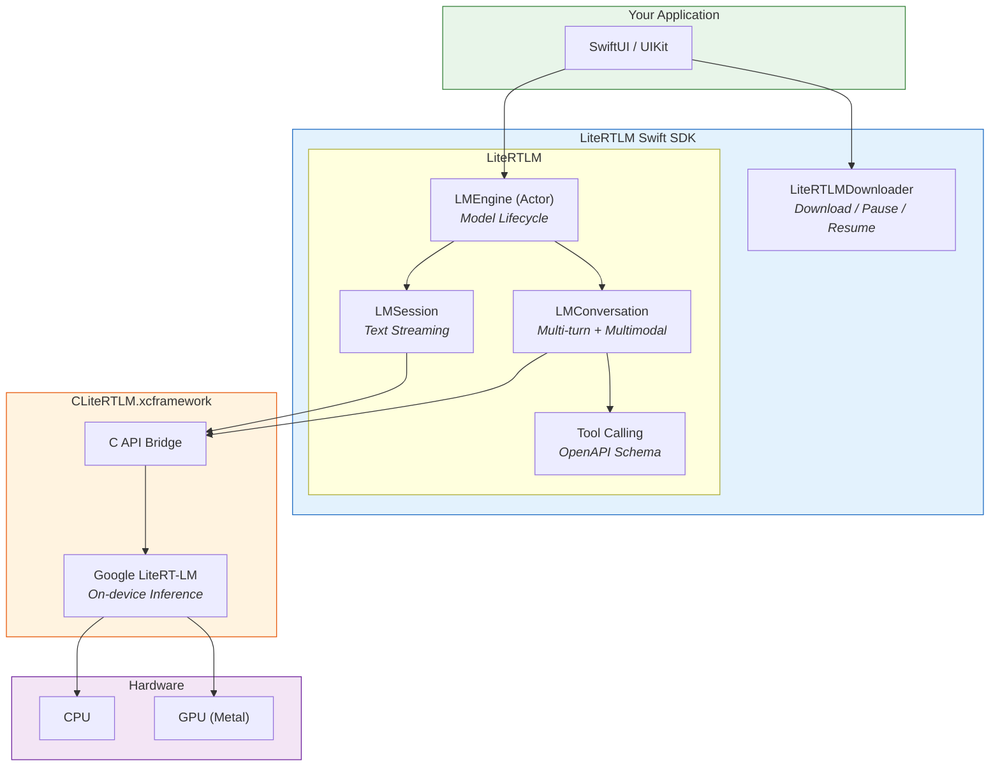

# LiteRTLM Swift SDK

Production-grade Swift SDK for [Google's LiteRT-LM](https://github.com/google-ai-edge/LiteRT-LM) on-device LLM inference engine. Run Gemma 4 and other LLMs entirely on-device with zero cloud dependency.

**iOS 17+ | macOS 14+ | Swift 5.9+**



---

## Features

| Feature | Description |
|---------|-------------|
| **Text Generation** | Streaming and blocking generation with Gemma-aware prompt templates |
| **Vision** | Send images (JPEG/PNG) alongside text for multimodal understanding |
| **Audio** | Process WAV, FLAC, or MP3 audio input for transcription and analysis |
| **Multi-turn Conversations** | Automatic KV-cache management for fast follow-up responses |
| **Tool Calling** | Register functions the model can invoke with automatic or manual execution |
| **Model Management** | Download, pause/resume, cancel, and delete `.litertlm` model files |
| **Streaming** | `AsyncSequence`-based token streaming with backpressure support |
| **Benchmark Metrics** | Prefill/decode speed, time-to-first-token, per-turn breakdowns |
| **Cross-Platform** | iOS and macOS from the same package |
| **Actor Concurrency** | Proper Swift actor isolation for thread-safe engine access |
| **Typed Errors** | Structured `LiteRTLMError` enum with descriptive recovery context |

---

## Installation

Add the dependency to your `Package.swift`:

```swift
dependencies: [
    .package(
        url: "https://github.com/Luxshan2000/LiteRTLM-Swift-SDK.git",
        from: "0.1.0"
    )
]
```

Add products to your target:

```swift
.target(
    name: "YourApp",
    dependencies: [
        .product(name: "LiteRTLM", package: "LiteRTLM-Swift-SDK"),
        .product(name: "LiteRTLMDownloader", package: "LiteRTLM-Swift-SDK"),
    ]
)
```

Or in Xcode: **File > Add Package Dependencies** > enter the repository URL.

> **Entitlements required for iOS:** Add `com.apple.developer.kernel.increased-memory-limit` and `com.apple.developer.kernel.extended-virtual-addressing` to your app's entitlements. Models consume ~4 GB of RAM.

> **Codesign note:** The `CLiteRTLM.xcframework` includes companion dynamic libraries that Xcode may not automatically re-sign. If your app crashes on launch with a `Library not loaded` / `code signature invalid` error, add a Run Script build phase:
> ```bash
> for DYLIB in \
>   "${BUILT_PRODUCTS_DIR}/${FRAMEWORKS_FOLDER_PATH}/CLiteRTLM.framework/libGemmaModelConstraintProvider.dylib" \
>   "${BUILT_PRODUCTS_DIR}/${FRAMEWORKS_FOLDER_PATH}/CLiteRTLM.framework/libLiteRtMetalAccelerator.dylib"; do
>   if [ -f "$DYLIB" ]; then
>     /usr/bin/codesign --force --sign "${EXPANDED_CODE_SIGN_IDENTITY}" "$DYLIB"
>   fi
> done
> ```

---

## Usage

### 1. Download & Load a Model

```swift
import LiteRTLM
import LiteRTLMDownloader

// Download the model (with progress tracking)
let downloader = ModelDownloader()
await downloader.download(model: .gemma4E2B) // ~2.4 GB

// Create and load the engine
let config = EngineConfiguration(modelPath: downloader.modelPath(for: .gemma4E2B)!)
    .backend(.gpu)
let engine = LMEngine(configuration: config)
try await engine.load()
```

### 2. Text Generation

**Streaming (recommended):**

```swift
let session = try await engine.createSession(
    configuration: SessionConfiguration()
        .maxOutputTokens(1024)
        .sampler(.balanced)
)

for try await token in session.generateStream("Explain quantum computing simply") {
    print(token, terminator: "")
}
```

**Blocking:**

```swift
let response = try await session.generate("What is Swift?")
print(response)
```

**Collect stream into a single string:**

```swift
let full = try await session.generateStream("Hello").collect()
```

### 3. Vision (Image Input)

```swift
let conversation = try await engine.createConversation()

// Single image
let photoData = UIImage(named: "cat")!.jpegData(compressionQuality: 0.8)!
let description = try await conversation.send(
    "What's in this image?",
    images: [photoData]
)

// Multiple images
let comparison = try await conversation.send(
    "What's different between these two photos?",
    images: [photo1Data, photo2Data]
)
```

Images are automatically resized to fit the model's max dimension (default 1024px) and JPEG-encoded.

### 4. Audio Input

```swift
let conversation = try await engine.createConversation()

let audioData = try Data(contentsOf: recordingURL)
let transcript = try await conversation.send(
    "Transcribe this audio",
    audio: [audioData],
    audioFormat: .wav  // also: .flac, .mp3
)
```

### 5. Combined Multimodal

```swift
let response = try await conversation.send(
    "Describe what you see and hear",
    images: [photoData],
    audio: [audioData],
    audioFormat: .wav
)
```

### 6. Multi-turn Conversation

Conversations maintain KV-cache across turns. First turn takes ~20s, follow-ups take ~1-2s.

```swift
let conversation = try await engine.createConversation(
    configuration: ConversationConfiguration()
        .maxOutputTokens(1024)
        .sampler(.creative)
)

let reply1 = try await conversation.send("Tell me about Tokyo")
let reply2 = try await conversation.send("What about the food scene?")
let reply3 = try await conversation.send("Give me a 3-day itinerary")

// Access conversation history
print(conversation.history.count) // 6 (3 user + 3 model messages)

// Done
conversation.close()
```

### 7. Tool Calling

LiteRTLM uses an **OpenAPI-style function calling format** — not MCP. You define tools with a name, description, typed parameters, and an execution closure. When the model decides to call a tool, the SDK handles the round-trip automatically (or you handle it manually).

**Define a tool:**

```swift
let weatherTool = Tool(
    name: "get_weather",
    description: "Get current weather for a location",
    parameters: [
        .init(name: "city", type: .string, description: "City name", required: true),
        .init(name: "unit", type: .string, description: "celsius or fahrenheit"),
    ]
) { args in
    let city = args["city"] as? String ?? "unknown"
    // Your logic here — call an API, read a sensor, query a database
    return ["temperature": 22, "condition": "sunny", "city": city]
}
```

**Automatic execution** (SDK calls the tool and feeds the result back):

```swift
let conversation = try await engine.createConversation(
    configuration: ConversationConfiguration()
        .tools([weatherTool, searchTool, calculatorTool])
        .toolExecution(.automatic)
)

// The model will call get_weather, get the result, and respond naturally
let response = try await conversation.send("What's the weather in Tokyo?")
// → "It's currently 22°C and sunny in Tokyo!"
```

**Manual execution** (you handle the tool call yourself):

```swift
let conversation = try await engine.createConversation(
    configuration: ConversationConfiguration()
        .tools([weatherTool])
        .toolExecution(.manual)
)

let response = try await conversation.send("What's the weather in Tokyo?")
// → '{"function_call": {"name": "get_weather", "arguments": {"city": "Tokyo"}}}'
// Parse and handle the tool call in your app
```

**Tool parameter types:**

| Type | Swift Mapping |
|------|--------------|
| `.string` | `String` |
| `.number` | `Double` |
| `.integer` | `Int` |
| `.boolean` | `Bool` |
| `.array` | `[Any]` |
| `.object` | `[String: Any]` |

**Adding multiple tools:**

```swift
let searchTool = Tool(
    name: "web_search",
    description: "Search the web for information",
    parameters: [
        .init(name: "query", type: .string, description: "Search query", required: true),
        .init(name: "limit", type: .integer, description: "Max results"),
    ]
) { args in
    let query = args["query"] as? String ?? ""
    return ["results": ["Result 1", "Result 2"], "query": query]
}

let calculatorTool = Tool(
    name: "calculate",
    description: "Evaluate a math expression",
    parameters: [
        .init(name: "expression", type: .string, description: "Math expression", required: true),
    ]
) { args in
    let expr = args["expression"] as? String ?? "0"
    // Your calculation logic
    return ["result": 42, "expression": expr]
}

let config = ConversationConfiguration()
    .tools([weatherTool, searchTool, calculatorTool])
    .toolExecution(.automatic)
```

### 8. Benchmark Metrics

```swift
let config = EngineConfiguration(modelPath: modelURL)
    .benchmarkEnabled(true)

// After generating...
if let metrics = session.benchmarkInfo() {
    print("Init time: \(metrics.initTime)s")
    print("Time to first token: \(metrics.timeToFirstToken)s")
    print("Avg decode speed: \(metrics.averageDecodeSpeed) tok/s")
    print("Avg prefill speed: \(metrics.averagePrefillSpeed) tok/s")
    print("Total tokens: \(metrics.totalTokensGenerated)")
}
```

### 9. Cleanup

```swift
session.close()       // Release session KV-cache
conversation.close()  // Release conversation resources
await engine.unload() // Release model from memory
```

---

## Configuration Reference

### EngineConfiguration

```swift
EngineConfiguration(modelPath: url)
    .backend(.gpu)                    // .cpu (default) or .gpu (Metal)
    .fallbacks(.cpu)                  // fallback if primary fails
    .maxTokens(4096)                  // max context length
    .cacheDirectory(cacheURL)         // compiled model artifact cache
    .benchmarkEnabled(true)           // enable timing instrumentation
    .logLevel(.warning)               // .verbose / .info / .warning / .error / .silent
```

### SessionConfiguration

```swift
SessionConfiguration()
    .maxOutputTokens(1024)            // max tokens per response
    .sampler(.balanced)               // preset: .greedy / .balanced / .creative
    .sampler(SamplerConfiguration(    // or custom
        temperature: 0.8,
        topK: 50,
        topP: 0.95
    ))
```

### ConversationConfiguration

```swift
ConversationConfiguration()
    .maxOutputTokens(1024)
    .sampler(.balanced)
    .tools([myTool1, myTool2])        // registered tools
    .toolExecution(.automatic)        // .automatic or .manual
    .maxImageDimension(1024)          // resize images to fit
```

---

## Architecture

### Module Breakdown

| Module | Purpose | Dependencies |
|--------|---------|-------------|
| **LiteRTLM** | Public API — engine, sessions, conversations, streaming, tools, multimodal | CLiteRTLM |
| **LiteRTLMDownloader** | Model download management — progress, pause/resume, registry | None |
| **CLiteRTLM** | Pre-built xcframework binary from Google's LiteRT-LM | None |

### Key Design Decisions

- **Actor isolation** for `LMEngine` — the engine holds mutable C pointers; actor serialization prevents data races without manual locking.
- **`@unchecked Sendable` classes** for `LMSession` and `LMConversation` — these use a dedicated serial `DispatchQueue` internally because the C API callbacks are not actor-compatible. The queue guarantees exclusive access.
- **Builder-pattern configurations** — immutable value types with copy-on-write builders. Each `.method()` returns a new copy, making configs safe to share.
- **`TokenStream` wrapping `AsyncThrowingStream`** — provides a typed `AsyncSequence` with `.collect()` convenience, hiding the raw stream.
- **OpenAPI-style tool schemas** — tools are defined with typed parameters that generate JSON schemas matching Gemma's function calling format. This is not MCP — it's a simpler, on-device-native format.

---

## Examples

See [`Examples/ChatDemo`](Examples/ChatDemo) for a complete iOS app with:
- Text chat with streaming responses
- Voice input via Speech framework
- Photo attachment via PhotosPicker
- Model download with progress UI
- Clean SwiftUI architecture

To run: `cd Examples/ChatDemo && xcodegen generate && open ChatDemo.xcodeproj`

---

## Building the XCFramework from Source

The SDK ships with a pre-built `CLiteRTLM.xcframework` — no extra steps needed. If you want to rebuild it from Google's LiteRT-LM source:

```bash
./scripts/build-xcframework.sh --repo-path /path/to/LiteRT-LM
```

---

## Requirements

| Requirement | Detail |
|-------------|--------|
| **iOS** | 17.0+ |
| **macOS** | 14.0+ |
| **Swift** | 5.9+ |
| **Device** | iPhone 13 Pro+ / any Apple Silicon Mac |
| **RAM** | 6 GB+ available (~4 GB consumed by model) |
| **Entitlement** | `increased-memory-limit` (iOS) |
| **Model** | `.litertlm` format (Gemma 4 E2B recommended) |

---

## License

Apache 2.0 — see [LICENSE](LICENSE) and [NOTICE](NOTICE).

This project includes compiled binaries from [Google's LiteRT-LM](https://github.com/google-ai-edge/LiteRT-LM), also licensed under Apache 2.0. This is **not** an official Google product.
